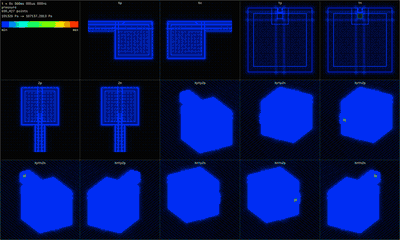
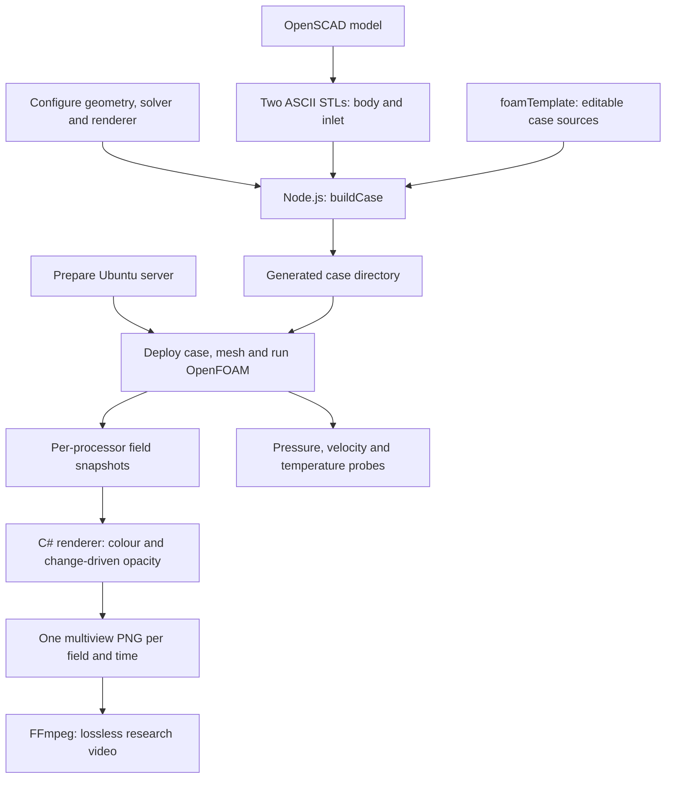

# OcarinaFoam — an ocarina research starting point

# 

Turn a parametric ocarina model into an OpenFOAM experiment, then turn its changing three-dimensional air fields into annotated scientific video.

### OcarinaZeroCase videos

| Field | 60 FPS | 120 FPS | 240 FPS | 480 FPS |
|---|---|---|---|---|
| Pressure | [Watch](https://www.youtube.com/watch?v=9_oWBXksIOY) | [Watch](https://www.youtube.com/watch?v=dqHktWOQci8) | [Watch](https://www.youtube.com/watch?v=zWBa4HkiTio) | [Watch](https://www.youtube.com/watch?v=Dvpq2F30lOU) |
| Velocity magnitude | [Watch](https://www.youtube.com/watch?v=2CfaEVaUXsM) | [Watch](https://www.youtube.com/watch?v=69UNfQ_1l8E) | [Watch](https://www.youtube.com/watch?v=SgjwwW2N55Q) | [Watch](https://www.youtube.com/watch?v=yaUqI6EP92Y) |
| Temperature | [Watch](https://www.youtube.com/watch?v=lxBcayr026U) | [Watch](https://www.youtube.com/watch?v=SVbE2TpX_fU) | [Watch](https://www.youtube.com/watch?v=fJ73UJ9hEtQ) | [Watch](https://www.youtube.com/watch?v=gjJbYfCYo1o) |
| Density | [Watch](https://www.youtube.com/watch?v=MOF4CzigN-A) | [Watch](https://www.youtube.com/watch?v=wnvVNuclGA4) | [Watch](https://www.youtube.com/watch?v=eWT8YsGXfkc) | [Watch](https://www.youtube.com/watch?v=dfPF3lcoBMM) |




This project grew out of hundreds of hours of work, trial runs, failed deployments and experiments that sometimes failed only after several days. Its purpose is to make that assembled pipeline available as a starting point for other instrument makers, researchers and coding agents: change geometry, understand the assumptions, generate another experiment, and build on the parts that are useful.

**This repository makes no claim of scientific accuracy.** A working solver, attractive wavefronts and a completed video are different achievements from a validated acoustic model. The supplied case is an exploratory baseline, not a prediction of an instrument's pitch, loudness, timbre or playing behaviour. It includes consequential approximations and unresolved limitations, documented below rather than silently corrected.

**`ocarinaZero/ocarinaZeroCase/` is entirely generated by `buildCase.js`. Do not edit it directly.** Edit `foamTemplate/` for case/renderer changes, the root JSON for exposed settings, and the input CAD/STLs for geometry. Regeneration recursively deletes the existing generated case directory, including any results stored there. Generate into a separate experiment input folder when preserving an existing run.

This documentation describes the frozen source and supplied configuration as of **29 September 2026**, targeting **OpenCFD OpenFOAM v2606**. That release name is not “OpenFOAM 2.6”; Foundation OpenFOAM releases are a separate distribution with different compatibility expectations. Explanations of design tradeoffs below describe what the choices provide, not an invented record that every alternative was experimentally rejected.

## Contents

- [What is in the repository](#what-is-in-the-repository)
- [Prepare an Ubuntu server](#prepare-an-ubuntu-server)
- [Geometry and case generation](#geometry-and-case-generation)
- [Configuration reference](#configuration-reference)
- [OpenFOAM model and numerical choices](#openfoam-model-and-numerical-choices)
- [Rendering the changing volume](#rendering-the-changing-volume)
- [Video and probe output](#video-and-probe-output)
- [Operational limits and troubleshooting](#operational-limits-and-troubleshooting)
- [Using this as a research baseline](#using-this-as-a-research-baseline)
- [Samples](#samples)
- [CC0 and third-party material](#cc0-and-third-party-material)
- [Primary references](#primary-references)

## What is in the repository

| Path | Role and editing rule |
| --- | --- |
| `buildCase.config.json` | Complete exposed configuration. Read at generation time; editing it does not change an existing case. Kept as strict JSON, with its documentation here rather than invalid JSON comments. |
| `buildCase.js` | Node generator, input checks, fixed air constants, six probe coordinates, template manifest and output assembly. Uses Node built-ins; no npm install is needed. |
| `fn/` | Small helpers for ASCII STL, geometry bounds, background blocks, damping, diagnostics, number formatting, template substitution and video command text. |
| `foamTemplate/0/` | Initial and boundary fields. These are editable source templates. |
| `foamTemplate/constant/` | Air thermodynamics and turbulence model. |
| `foamTemplate/system/` | Mesh, solver, sampling and damping dictionaries. |
| `foamTemplate/render/FoamRenderer.cs` | Renderer source template; a .NET 10 file-based application with package directives. |
| `foamTemplate/render/JuliaMono-Regular.ttf` | Bundled font, under its own SIL Open Font License. |
| `foamTemplate/systemd/` | Solver and renderer service templates. |
| `foamTemplate/instructions.md` | Short generated-case command reference. The README holds the full explanation. |
| `ocarinaZero/model.scad` | Parametric baseline CAD. Required by the generator and copied into the case as provenance. |
| `ocarinaZero/solidBody.stl` | Body alone, ASCII STL in millimetres. |
| `ocarinaZero/spawnPlane.stl` | Separate thin inlet box, ASCII STL in millimetres. |
| `ocarinaZero/ocarinaZeroCase/` | Disposable generated example, not another source tree. `.gitignore` excludes `*Case/`. |
| `cc.js` | Optional text bundler for human/agent review: `node cc.js` produces `cc.txt`. It does not obey `.gitignore` and can include generated/plaintext results; inspect before sharing. |

The generated case has three boundary names: `airSource` for the rectangular inlet, `atmosphere` for the outer world, and `solidWalls` for the instrument. It also has a `.foam` marker usable by a separate OpenFOAM-capable viewer. ParaView, Python, VTK, a GPU and an X server are **not dependencies of the supplied renderer**.

The builder does not execute OpenSCAD, upload files, run meshing, solve equations or encode video. It prepares a directory and command reference. Server placement remains an operator action. The detailed server guide below prepares the machine itself; it does not prescribe a cloud provider or automate case deployment.

## Prepare an Ubuntu server

### 1. Choose and install the operating system

Use an **Ubuntu Server 24.04 LTS x86-64** installation as the documented package target. Install from Ubuntu's server image or select that image with your server provider. Enable OpenSSH during installation and create a normal account with sudo access. A desktop environment is unnecessary. On a local installer, allocate the intended storage explicitly rather than assuming the disk capacity becomes the root filesystem capacity. Use a stable hostname and network connection; obtain the IP address from the machine's console or provider.

This choice gives a concrete package/path baseline. Ubuntu 26.04, containers, WSL, other distributions and other architectures may work, but are not interchangeable assumptions for these instructions. Check upstream package availability before changing the platform. OpenFOAM's release and installation pages are linked under [references](#primary-references).

There is no honest fixed RAM requirement independent of mesh and concurrency. Meshing can temporarily need substantially more memory than the solver. The renderer duplicates large arrays per worker, while the solver runs at the same time. Fast local SSD/NVMe storage helps the very heavy field-write/decompression workload. A GPU will not accelerate this C# drawing implementation. Begin with a short benchmark before allocating days of compute.

### 2. Update packages and install base tools

Log in from your workstation, replacing the example account and host:

```bash
ssh researcher@SERVER_IP
```

On the server:

```bash
sudo apt update
sudo apt upgrade
sudo apt install -y ca-certificates curl gnupg software-properties-common \
    openssh-server git unzip rsync tmux htop sysstat ffmpeg
sudo systemctl enable --now ssh
```

Reboot if the package upgrade requires it, then reconnect. `tmux` is useful for interactive preparation; systemd runs the eventual long-lived solver and renderer independently of an SSH session. `rsync` is available for later transfers, but no transfer is performed by this setup.

For key-based login, create a key on the workstation only if you do not already have one, then install its public key:

```bash
ssh-keygen -t ed25519
ssh-copy-id researcher@SERVER_IP
ssh researcher@SERVER_IP
```

`ssh-copy-id` is normally available on Linux/macOS; Windows users can install the public key through their SSH client or the server console. Keep the private key on the workstation. Confirm a second login works before changing authentication settings. [Ubuntu OpenSSH documentation][ubuntu-ssh] covers server configuration.

If using Ubuntu's firewall, allow the actual SSH port before enabling it. The following assumes the default port and OpenSSH profile:

```bash
sudo ufw allow OpenSSH
sudo ufw enable
sudo ufw status
```

There is no renderer web server or required public visualization port. Remote ParaView would be a separate setup.

### 3. Check the filesystem that will hold the experiment

```bash
lsblk -o NAME,SIZE,FSTYPE,TYPE,MOUNTPOINTS
df -h
df -i
free -h
nproc
sudo vgs
sudo lvs
```

`vgs` and `lvs` apply to LVM systems; install `lvm2` if needed. A large physical disk does not imply a large root filesystem: an installer may leave most of an LVM volume group unallocated. Inspect the actual mount that will contain the case and PNG output. Both free bytes and free inodes matter when creating millions of files.

If, and only if, the inspected layout is the standard Ubuntu LVM root `/dev/ubuntu-vg/ubuntu-lv` and you intend to give that root filesystem all free space in its volume group, the usual expansion is:

```bash
sudo lvextend -l +100%FREE -r /dev/ubuntu-vg/ubuntu-lv
df -h /
```

Use the device shown by your own `lvs`; do not copy that device name into an unrelated layout. A separate data volume mounted at a stable path is equally suitable. The configured runtime account must own or have write access to the case, renderer output and .NET/NuGet cache. Swap may cushion a transient allocation spike, but sustained swapping is not a substitute for sufficient RAM.

### 4. Install the targeted OpenFOAM distribution

Use the OpenCFD repository and the **versioned** package, rather than Ubuntu's generic `openfoam` package or a Foundation release:

```bash
curl -fsSL https://dl.openfoam.com/add-debian-repo.sh -o /tmp/add-openfoam-repo.sh
less /tmp/add-openfoam-repo.sh
sudo bash /tmp/add-openfoam-repo.sh
sudo apt update
apt-cache policy openfoam2606-default
sudo apt install -y openfoam2606-default
```

The repository helper changes package sources; review it before running it as root. If the package has no candidate, check the OS codename and current official repository instructions rather than substituting an arbitrary version. Package availability can change; the precise package revision should be recorded with each research run.

Load the environment in the current shell:

```bash
source /usr/lib/openfoam/openfoam2606/etc/bashrc
foamVersion
command -v blockMesh snappyHexMesh surfaceFeatureExtract checkMesh rhoPimpleFoam mpirun
rhoPimpleFoam -help
mpirun --version
```

Sourcing applies to that shell. Repeat it in a new interactive shell or add that exact source line to your shell startup file if this is your only OpenFOAM version. The generated solver unit already sources the versioned path explicitly. A missing `openfoam` shell alias is not a failure if these executables resolve correctly.

The versioned OpenFOAM package brings its packaged dependencies. Use its compatible MPI environment; do not independently change the MPI implementation merely because another package is newer. Check the actual environment after sourcing OpenFOAM. No OpenFOAM solver compilation is required by this repository.

### 5. Install Node.js where cases will be generated

Node is needed on the build workstation, or on the server only if the server also builds cases. Ubuntu 24.04's Node package supports the features used here:

```bash
sudo apt install -y nodejs
node --version
node -e "console.log(Object.hasOwn({ok: true}, 'ok'))"
```

The final command should print `true`. There is no `package.json` and no third-party JavaScript dependency. A separately maintained Node installation is also suitable; no `/usr/bin/node` symlink replacement or globally installed npm tooling is necessary. OpenSCAD belongs wherever you author/export geometry and is not needed merely to solve a generated case.

### 6. Install the .NET 10 SDK

The renderer is compiled from its `.cs` file when started, so install the **SDK**, not only the runtime. On the documented Ubuntu 24.04 package target, current Microsoft instructions use Ubuntu's feed:

```bash
sudo apt update
apt-cache policy dotnet-sdk-10.0
sudo apt install -y dotnet-sdk-10.0
/usr/bin/dotnet --list-sdks
/usr/bin/dotnet --info
```

The service explicitly invokes `/usr/bin/dotnet`; a private installation accessible only through an interactive shell's PATH does not satisfy that path. If no package candidate exists, consult the version-specific [Ubuntu .NET installation instructions][dotnet-ubuntu]. Do not mix Ubuntu and Microsoft feeds to work around the problem without resolving package origin conflicts.

The file declares `SkiaSharp` and `SkiaSharp.NativeAssets.Linux.NoDependencies`, both at `3.119.1`. Initial restore requires access to NuGet and a writable cache for the runtime user. “NoDependencies” is the package name, not a promise that .NET or the operating system has no native dependencies. Package-managed .NET handles its system dependencies. No graphics session is required.

An optional machine-only compilation check, run as the intended account, does not touch a case or start rendering:

```bash
mkdir -p /tmp/foams-sdk-check
cat > /tmp/foams-sdk-check/check.cs <<'CS'
#:package SkiaSharp@3.119.1
#:package SkiaSharp.NativeAssets.Linux.NoDependencies@3.119.1
#:property PublishAot=false
using SkiaSharp;
using var bitmap = new SKBitmap(16, 16);
System.Console.WriteLine($"Skia bitmap: {bitmap.Width} x {bitmap.Height}");
CS
/usr/bin/dotnet run --file /tmp/foams-sdk-check/check.cs -c Release
```

This checks package restore and native bitmap allocation, not the CFD reader or a real render. It also pre-populates the package cache under the account that ran it. [.NET file-based application documentation][dotnet-file] explains the `#:` directives and `--file` invocation.

### 7. Confirm machine readiness

```bash
systemctl --version
ffmpeg -version
ffmpeg -hide_banner -h encoder=ffv1
node --version
/usr/bin/dotnet --list-sdks
source /usr/lib/openfoam/openfoam2606/etc/bashrc
foamVersion
```

The machine is now prepared. No case has been deployed or service installed by these steps. Before a run, record these version outputs, CPU/RAM and disk capacity. The fixed source paths and package versions are part of reproducibility; “latest” is not an experiment identifier.

## Geometry and case generation

### Coordinate contract

The baseline uses **millimetres in CAD/STL**, **metres in OpenFOAM**, `+Y` from the mouth down the throat toward the chamber, and `+Z` upward. The body is on the `Y >= 0` side. The inlet face lies exactly at `Y = 0`, on the minimum-Y boundary of the air world. This is a specific geometry contract, not an arbitrary-STL importer.

The baseline dimensions in `model.scad` are a 5 mm wall thickness, a nominal 5 × 5 mm throat cross-section with 50 mm throat length, a 5 × 5 mm voicing opening, a 10 mm edge-forming length, and a 50 × 50 × 50 mm chamber. The model uses overlapping cutting volumes extending beyond some nominal endpoints to make Boolean cuts. No finger holes are included. The wedge is a subtractive shape forming the labium region; this geometry is a starting configuration, not an established optimum.

### Export two separate ASCII STLs

`solidBody.stl` must contain only the solid instrument. `spawnPlane.stl` must contain only the small box from `Y = -1` to `Y = 0`, covering the throat opening. Its finite thickness makes it exportable by OpenSCAD. The final lines of the supplied model call **both** modules for display; exporting that whole scene does not create the required separation.

One reproducible approach is temporary wrapper files next to `model.scad`. OpenSCAD `use` imports modules without executing the file's top-level calls:

```scad
// export-solid.scad
use <model.scad>
solidBody();
```

```scad
// export-spawn.scad
use <model.scad>
spawnPlane();
```

From that input directory, with OpenSCAD available:

```bash
openscad --export-format asciistl -o solidBody.stl export-solid.scad
openscad --export-format asciistl -o spawnPlane.stl export-spawn.scad
```

Alternatively export the modules separately through the GUI, selecting ASCII STL. Check that the output begins with readable `solid`/`facet` text. Changing `model.scad` alone does not update either STL: export again before rebuilding. The builder requires `model.scad` even though it does not parse or execute it; the file is copied into `geometry/` as a record of the design.

### What happens to the inlet

The generator discards an entire inlet triangle if **any** vertex has `Y < 0`. It does not cut triangles at the plane. The thin-box convention leaves its two front-face triangles. If none survive, generation fails; that can mean the box ends below zero or that no whole triangle survives, not necessarily that every vertex is below zero.

`buildBackgroundMesh` then requires the retained surface to have a single Y coordinate matching the world's minimum Y. Its **X/Z bounding rectangle** becomes `airSource` in `blockMesh`. The saved filtered STL is not independently snapped into an arbitrary-shaped inlet. A circular or irregular spawn surface still supplies rectangular bounds in this implementation.

The world expands the body bounds by the requested padding, then rounds outward to the coarse grid. The X and Z block bands align exactly with the inlet edges. Narrow remainder bands can create cells smaller than the nominal background size. The fluid region retained by `snappyHexMesh` is connected to a point near the world's upper corner; the chamber must be connected to that exterior fluid through its openings.

### Generate the files

Edit the root JSON first, especially the runtime directory, processor count and output workload. From the repository root:

```bash
node buildCase.js ocarinaZero
```

The result is `ocarinaZero/ocarinaZeroCase/`. For another input folder `experimentA`, the result is `experimentA/experimentACase/`. There is one root configuration, no per-folder automatic override and no command-line config option.

`caseRuntimeDirectory` is the **parent on the eventual server**, not the local input folder. With `/home/adrian/`, the generated runtime path is `/home/adrian/ocarinaZeroCase`. It is embedded in the renderer and units. The service account is captured from `SUDO_USER`, then `USER`, then `USERNAME`, falling back to `root`. If building on another account, set the intended environment before building. On a POSIX shell, for example:

```bash
env -u SUDO_USER USER=researcher node buildCase.js ocarinaZero
```

Set the corresponding runtime parent in JSON as well. Use uncomplicated paths without spaces or shell metacharacters; template substitution does not escape every destination language. The generator emits both `constant/fvOptions` and `system/fvOptions` identically. It copies only its explicit file manifest, plus listed static assets; merely adding a new file to `foamTemplate` does not automatically include it.

Generated `instructions.md` contains the existing meshing/service commands. In sequence, the operational stages are surface inspection, feature extraction, background mesh, surface refinement/snapping, final mesh inspection, decomposition, then solver and renderer. The supplied command sequence meshes serially before decomposition; the solver uses MPI. The units do not mesh or decompose for you. Neither unit establishes a solver/renderer dependency on the other.

## Configuration reference

Values here are those in the supplied JSON, not values inferred from an older run. Options that require changing templates or source are labelled separately. All current JSON leaves are documented below. The generator has targeted checks, not a comprehensive configuration schema: keep counts positive, dimensions sensible and refinement levels consistent.

### Paths, dimensions and mesh

| Setting | Supplied value | Meaning, rationale and alternatives |
| --- | --- | --- |
| `caseRuntimeDirectory` | `/home/adrian/` | Server parent of the generated case. Replace for your account/mount before generation. Moving only the folder later leaves baked paths stale. |
| `stlMillimetersToMeters` | `0.001` | Converts geometry and configured millimetre dimensions to metres. Preserve this for millimetre inputs. It also scales padding/refinement/damping dimensions, so it is not an isolated STL-format switch. Probe coordinates are already metres. |
| `processorCount` | `6` | MPI subdomains, solver ranks and renderer's expected `processorN` count. More partitions can reduce solve time but increase communication and filesystem overhead. It is unrelated to the renderer worker count despite equal defaults. |
| `worldPaddingMillimeters.xMin`, `.xMax` | `100`, `100` | Air beyond each X side of the body. Larger space postpones boundary interaction and can accommodate more damping, at greater mesh cost. |
| `worldPaddingMillimeters.yMin`, `.yMax` | `0`, `100` | Minimum Y must remain aligned to the inlet at zero. Simply adding upstream padding violates that contract. Downstream padding changes available external air. |
| `worldPaddingMillimeters.zMin`, `.zMax` | `100`, `100` | Air below/above the body. Asymmetric values are possible; evaluate boundary distance in all directions. |
| `backgroundCellSizeMillimeters` | `5` | Nominal coarse cell width. Smaller values refine the whole background, quickly increasing memory; regional refinement is more selective. Source-aligned remainder bands can be thinner. |
| `surfaceRefinementMinLevel` | `3` | Minimum surface intersection refinement target: nominally 0.625 mm at level 3. Raising it improves general surface sampling at a substantial cost. |
| `surfaceRefinementMaxLevel` | `5` | Higher surface refinement target used where the mesher's feature/curvature criteria request it: nominally 0.15625 mm. This also feeds the builder's acoustic estimate, which is not an actual mesh minimum. |
| `featureRefinementLevel` | `5` | Target along explicitly extracted edges. Useful for lip and corner geometry, provided the feature mesh is correctly scaled/aligned. See the known scaling issue below. |
| `nCellsBetweenLevels` | `3` | Transition buffer between refinement levels. More cells smooth size transitions but expand the refined region. |
| `bodyDistanceRefinement` | `10 mm: 1`, `5 mm: 2`, `2 mm: 3` | Distance-to-surface refinement: level 1 within 10 mm, level 2 within 5 mm, level 3 within 2 mm, combined with other refinement demands. The builder sorts increasing distance. Each entry has `distanceMillimeters` and integer `level`. Broader/higher bands resolve more surrounding flow but add cells. |
| `featureIncludedAngleDegrees` | `150` | Edge extraction included-angle threshold. Larger values generally retain gentler departures from flatness. Separate from the fixed `resolveFeatureAngle 30` in snappy. An alternative is implicit feature detection, requiring template changes. |

The nominal width at refinement level `L` is `h = 5 / 2^L` mm:

| Level | 0 | 1 | 2 | 3 | 4 | 5 |
| --- | --- | --- | --- | --- | --- | --- |
| Width in mm | 5 | 2.5 | 1.25 | 0.625 | 0.3125 | 0.15625 |

Refining a complete three-dimensional volume by one level can multiply its cell count by approximately eight. The actual mesh also depends on geometry intersections, transition bands and snapping; the table is a scale estimate, not the final cell-size distribution.

### Flow and sampling

| Setting | Supplied value | Meaning, rationale and alternatives |
| --- | --- | --- |
| `inletVelocityMetersPerSecond` | `12` | Immediate fixed +Y velocity at the inlet. Defines the operating condition; it is not a breath-pressure value. A ramp, measured waveform, pressure inlet or developed inlet profile would require template changes. |
| `ambientPressureHectopascals` | `1013.25` | Initial and far-field reference pressure, converted to 101325 Pa. The solved `p` is absolute pressure. |
| `initialTemperatureCelsius` | `26.85` | Converts to 300 K for initial/inlet temperature. Temperature affects density and sound speed. |
| `deltaTSeconds` | `0.0000001` | Fixed 0.1 microsecond solver step. `adjustTimeStep no` keeps regular physical sampling and frame numbering. Smaller steps cost more solve work; larger ones require stability/dispersion investigation. |
| `endTimeSeconds` | `3` | Requested physical duration. The builder adds the renderer's lag allowance, giving 3.000003 s with this configuration. Alignment with the field-write interval matters if the value is changed. |
| `fieldWriteIntervalTimeSteps` | `10` | Full fields every 1 microsecond. Denser writes expose short-time propagation but impose extreme I/O and render demand. Increase for a coarser visual sampling interval. |
| `probeWriteIntervalTimeSteps` | `1` | Probe samples every 0.1 microsecond. Probes are much smaller than full fields but can still become large over 30 million steps. Sampling rate alone does not imply equivalent trustworthy acoustic bandwidth. |
| `fieldWriteFormat` | `ascii` | Required by the custom field/mesh reader. Binary is not supported, compressed binary is also not supported. |
| `fieldWriteCompression` | `true` | Gzip field output; saves disk bytes at compression/decompression CPU cost. `false` is supported for ASCII. If both a plain and `.gz` file exist, the reader prefers the plain file. Fields can be several GB of plain text or a few MB compressed in some cases. |

Three clocks must be kept distinct:

| Quantity | Supplied result |
| --- | --- |
| Solver steps through requested duration | `3 / 1e-7 = 30,000,000` |
| Full-field interval | `10 × 1e-7 = 1e-6 s` |
| Field sampling rate | `1,000,000 snapshots/s` of simulated time |
| Nominal requested positive field times | `3,000,000` |
| Probe sampling rate | `10,000,000 samples/s` per probe |
| PNG count for four enabled fields | Up to `12,000,000` through requested duration |
| Video duration at 10 frames/s | `300,000 s`, about 83 h 20 min **per field** |
| Slowdown relative to physical time | `100,000×` |

The additional three writes allow the requested ending to fall outside the newest-time buffer; they are not meant to add visible experiment duration. Rendering throughput is independent of solver throughput. If snapshots accumulate faster than they are consumed, disk backlog grows even though old frames are eventually deleted. PNGs are retained indefinitely. At an illustrative 1 MB per PNG, twelve million PNGs alone would be about 12 TB; measure actual image sizes rather than assuming that example.

For 1,000 field snapshots per simulated second at the same solver step, the interval would be `10,000` steps. That is an alternative experiment setting, not the supplied one. Changing only `renderer.fps` does not reduce solver output or rendering work.

The builder estimates `c = sqrt(gamma × R × T)` and `(c + inletSpeed) × deltaT / hMin`. With its fixed `gamma = 1.4`, molar mass 28.9 and 300 K, `c` is about 347.6 m/s and the nominal acoustic Courant number is about 0.230. The warning threshold of 0.5 is advisory. Actual local cell sizes/velocities, discretisation and solver coupling matter; a low printed flow Courant number alone does not assess sound-wave resolution. The helper uses only maximum **surface** level, so higher feature/distance levels or thin block bands make the estimate optimistic.

### Exterior damping

| Setting | Supplied value | Meaning, rationale and alternatives |
| --- | --- | --- |
| `farFieldRelaxationLengthMeters` | `0.1` | `lInf` for the pressure `waveTransmissive` boundary's ambient relaxation. A length, not an absorber thickness or cell count. Changing it alters boundary response. |
| `acousticDampingEnabled` | `true` | Enables a velocity-relaxation sponge outside the body region. Disable to compare its influence, not as a promise that an undamped boundary is accurate. |
| `acousticDampingTargetFrequencyHz` | `3000` | Frequency parameter contributing to damping strength and the wavelength diagnostic. It does not tune the ocarina to 3 kHz or act as a narrow-band frequency filter. |
| `acousticDampingThicknessMillimeters` | `250` | Intended radial ramp thickness. At the diagnostic sound speed this is about 2.16 wavelengths at 3 kHz. It does not enlarge the mesh. |
| `acousticDampingClearanceMillimeters` | `20` | Gap beyond the sphere enclosing the body bounding box before damping begins. Larger clearance protects a larger near-body region but leaves less damping within a fixed world. |
| `acousticDampingStencilWidth` | `20` | Passed as `w`. Upstream calls it stencil width; its implementation multiplies frequency and radial blend in the damping coefficient. It is not a request to add 20 mesh layers. |

The source relaxes velocity toward `UMean`, which is **fixed zero**, not a computed average. The spherical origin is the body bounding-box centre. The inner radius is the box half-diagonal plus clearance; outer radius adds the thickness. The published implementation uses a smooth radial blend and strength proportional to `w × frequency`; increasing these can damp more strongly but does not automatically reduce reflections. See [source reference][foam-damping].

**The supplied geometry/domain does not contain the complete configured sponge.** Its body bounds are approximately `(-30, 0, -52.5)` to `(30, 105, 7.5)` mm; the domain is `(-130, 0, -155)` to `(130, 205, 110)` mm. The sponge centre is `(0, 52.5, -22.5)` mm, inner radius about 87.5 mm and outer radius about 337.5 mm. Every domain corner is closer than that outer radius. The full ramp therefore never fits inside the domain; parts of the minimum-Y boundary are even inside the undamped radius. A “two wavelengths” printed diagnostic describes the requested shell, not the amount actually traversed by outgoing waves. This frozen configuration needs reflection testing before quantitative acoustic use.

### Renderer settings

| Setting under `renderer` | Supplied value | Meaning, rationale and alternatives |
| --- | --- | --- |
| `untouchedTimes` | `3` | Leave at least the newest three positive times on each partition outside the render queue. A lag heuristic against incomplete writes, not proof of completion. Must be at least 1; zero causes an invalid cutoff index and is not a final-flush switch. |
| `renderThreads` | `6` | Six workers can process different times concurrently. Fields/views inside one job are processed sequentially. More workers increase arrays, CPU and memory-bandwidth contention. Lower this before increasing RAM pressure blindly. |
| `pollMilliseconds` | `2000` | Delay when no ready work is available, for discovery and idle workers. Changes pickup latency, not physical sampling. |
| `fps` | `10` | Playback rate in generated FFmpeg commands only. |
| `pngCompressionLevel` | `6` | Lossless PNG compression effort; lower values can save CPU at greater file size, higher values may save disk at greater CPU cost. |
| `plotWidth`, `plotHeight` | `1024`, `1024` | Per-tile dimensions. Fourteen views plus one legend produce a 5 × 3 grid, hence 5120 × 3072 PNGs at these settings. Different tile aspect ratios can change the chosen grid. |
| `marginPixels` | `20` | Per-view framing margin. It is not a geometric clip distance or extra simulation padding. |
| `labelFontPixels` | `40` | Text size for view titles and the information panel. Smaller tiles can make the fixed layout overflow; no automatic text fitting is implemented. |
| `backgroundColor` | `#050505` | Nearly black background against which semi-transparent samples accumulate. |
| `labelColor` | `#FAFAFA` | Nearly white titles, legend text and grid borders. |
| `pointSizePixels` | `3` | Circle diameter, independent of physical cell volume. Larger points improve visibility but increase overlap and occlusion. |
| `axisTiltDegrees` | `0` | Optional sequential camera-axis rotations to separate aligned rows of points visually. Zero preserves cardinal orientations. |
| `cameraPaddingFraction` | `0.2` | Expands solid bounding-box half-extents by a factor of 1.2 for framing; this is not 20% extra on each side of the full width. |
| `renderPressure` | `true` | Read `p`, write `pressure` composites in Pa. |
| `renderVelocityMagnitude` | `true` | Read `U`, reduce each vector to speed, write `velocityMagnitude` in m/s. Direction is not encoded. |
| `renderDensity` | `true` | Read `rho`, write `density` in kg/m³. The solver must write it at every eligible time. |
| `renderTemperature` | `true` | Read `T`, write `temperature` in K. |

At least one field must be enabled. These switches suppress renderer work and generated video commands; they do not switch off the solver's physics or preserve that field's raw data. The renderer deletes a completed time directory as a unit.

## OpenFOAM model and numerical choices

An ocarina is a jet-driven resonator: air leaves the throat near an edge, and the unsteady jet interacts with pressure in the chamber and outside air. Resolving both the flow and pressure propagation is the motivation for a transient compressible calculation. A visually plausible result is not evidence that all relevant losses, jet feedback or boundary interactions have been captured.

### Solver and thermodynamics

| Source choice | What it provides | Alternatives and their implications |
| --- | --- | --- |
| `rhoPimpleFoam` | Transient compressible pressure/velocity coupling with density and energy. The case evolves actual pressure disturbances. | Incompressible solvers are useful for jet-flow studies but do not directly propagate finite-speed compressible sound. Steady solvers discard oscillation. Compressible density-based/shock-oriented solvers target different numerical priorities. Hybrid flow-plus-acoustic methods separate source flow from sound propagation but need another coupling pipeline. |
| `hePsiThermo`, `pureMixture`, `perfectGas` | One-component ideal-gas thermodynamics. | Real-gas or species/mixing models add physics not represented in this baseline. They are not JSON toggles. |
| `eConst`, `sensibleInternalEnergy` | Constant heat capacity and an internal-energy variable `e`. `Cv = 712 J/(kg K)` and molar mass `28.9 kg/kmol` are fixed in the generator. | Temperature-dependent thermodynamics can better follow broad temperature changes, at greater model complexity. Enthalpy formulations need consistent energy/model dictionaries and schemes. |
| `transport const`, `mu = 1.8e-5`, `Pr = 0.7` | Fixed viscosity and Prandtl number. | Temperature-dependent transport may matter outside the narrow assumed air condition. Humidity, solid thermal conduction and structural vibration are absent. |
| `LES`, `WALE`, `cubeRootVol` | Model unresolved eddy effects while evolving resolved unsteady flow. Filter scale follows the cube root of cell volume. | Laminar avoids subgrid viscosity but needs a justification for unresolved motion; DNS requires resolution of the relevant dissipative scales. RANS primarily models averaged turbulence; unsteady RANS is not equivalent to resolved jet turbulence. Other LES models such as Smagorinsky or dynamic models change dissipation and near-wall behaviour. |

The fixed `gamma = 1.4` used by the builder's diagnostics and pressure boundary is not explicitly the solver's `Cv`. With the supplied molar mass and `Cv`, the ideal-gas ratio `1 + R/Cv` is about 1.404. The difference is small but should be visible to anyone reproducing the configuration. These are frozen choices, not a fitted thermodynamic calibration. [WALE documentation][foam-wale] describes the model; mesh adequacy remains an experiment question.

### Initial and boundary conditions

| Field | Initial state | `airSource` | `atmosphere` | `solidWalls` |
| --- | --- | --- | --- | --- |
| `p` | Ambient absolute pressure | `zeroGradient` | `waveTransmissive`, ambient `fieldInf`, `gamma 1.4`, `lInf 0.1` | `zeroGradient` |
| `U` | `(0 0 0)` | `fixedValue (0 12 0)` m/s | `pressureInletOutletVelocity`, zero inlet reference | `noSlip` |
| `T` | 300 K | `fixedValue 300` K | `inletOutlet`, 300 K on inflow | `zeroGradient` |
| `nut` | 0 | `zeroGradient` | `zeroGradient` | `zeroGradient` |
| `alphat` | 0 | `zeroGradient` | `zeroGradient` | `zeroGradient` |
| `UMean` | `(0 0 0)` | Fixed zero | Fixed zero | Fixed zero |

A fixed inlet velocity is simple to reproduce and parameterise. A pressure-driven inlet would let the flow respond differently to upstream conditions. The abrupt start launches a transient; a smooth ramp or measured breath waveform would change the attack and must be treated as a different input. There is no resolved player mouth or upstream reservoir.

Rigid no-slip walls are a fluid boundary approximation. There is no wood elasticity, clay porosity, surface roughness model or solid vibration. `T` zero gradient at the wall approximates no normal conductive temperature gradient; it is not a conjugate thermal solution. The `nut`/`alphat` boundaries and absence of prism layers do not demonstrate resolved viscous/thermal boundary-layer losses.

`waveTransmissive` is an approximate outgoing-wave condition with ambient relaxation. It can reduce boundary interference but is not an exact all-angle nonreflecting boundary. Fixed-pressure boundaries, advective/acoustic variants, larger domains and more carefully designed absorbing regions are alternatives requiring comparison. The exterior sponge and boundary condition act together; neither eliminates the need to measure reflections. See [waveTransmissive][foam-wave].

### Mesh dictionary choices beyond JSON

`castellatedMesh true` refines/cuts background cells around the surface; `snap true` moves the resulting boundary toward the STL. `addLayers false` avoids the additional complexity and cost of prism-layer generation. Layers could improve near-wall resolution when designed and verified appropriately, but enabling them without a layer specification and quality study is not a complete improvement.

| Fixed controls | Meaning and tradeoff |
| --- | --- |
| `maxLocalCells`, `maxGlobalCells = 2147483647` | Effectively no practical memory protection. These are integer ceilings, not sensible hardware budgets. |
| `minRefinementCells 0` | Does not stop a refinement stage merely because few cells remain to refine. |
| `resolveFeatureAngle 30` | Surface feature/curvature criterion for higher refinement; distinct from extraction `includedAngle`. |
| Generated `locationInMesh` | Selects fluid connected to the outer-corner seed. A fully sealed disconnected cavity can be discarded. |
| `allowFreeStandingZoneFaces true` | Allows relevant free-standing zone faces; no explicit face-zone research setup is configured here. |
| `nSmoothPatch 0` | No initial patch smoothing iterations. Other snapping iterations still run. |
| `tolerance 2.0` | Snap attraction-distance factor relative to local mesh scale, not 2 mm. |
| `nSolveIter 30`, `nRelaxIter 5`, `nFeatureSnapIter 10` | Iteration budgets for displacement, relaxation and feature snapping. More iterations can help convergence but cost time and do not fix bad geometry automatically. |
| `implicitFeatureSnap false`, `explicitFeatureSnap true`, `multiRegionFeatureSnap false` | Uses extracted feature files instead of implicit detection; multi-region feature handling is not requested. |
| `relativeSizes true`, empty `layers` | Dormant layer controls because `addLayers` is false. They do not create boundary layers. |
| `debug 0`, `mergeTolerance 1e-6` | Minimal debug output and a domain-relative merge tolerance. Not a 1 micrometre absolute CAD tolerance. |

Quality controls are fixed in `meshQualityControls`:

| Control | Value | Role |
| --- | --- | --- |
| `maxNonOrtho` | 65 | Limits angular non-orthogonality during mesh construction. |
| `maxBoundarySkewness`, `maxInternalSkewness` | 20, 4 | Different skewness allowances for boundary and internal faces. |
| `maxConcave` | 80 | Concavity angle limit. |
| `minVol` | `1e-13` | Minimum cell-pyramid volume threshold in the metre-scaled mesh. |
| `minTetQuality` | `1e-30` | Very permissive tetrahedral quality lower bound. |
| `minArea`, `minTriangleTwist` | -1, -1 | Disable those particular minimum checks. |
| `minTwist` | 0.02 | Face-twist quality lower bound. |
| `minDeterminant` | 0.001 | Cell determinant quality lower bound. |
| `minFaceWeight` | 0.02 | Lower bound associated with interpolation geometry. |
| `minVolRatio` | 0.01 | Lower bound for neighbouring volume ratio. |
| `nSmoothScale`, `errorReduction` | 4, 0.75 | Controls for smoothing/reducing mesh-motion corrections when quality fails. |

These settings reflect one construction strategy. Relaxing a failing threshold can permit a mesh to finish while worsening its numerical behaviour; tightening it can prevent completion. `checkMesh -allTopology -allGeometry` and inspection of the throat, lip and chamber connections remain necessary. See the [snappyHexMesh reference][foam-snappy] for alternative controls and version-specific meanings.

**Explicit feature scale needs verification.** The builder copies the body STL in millimetres and puts `scale 0.001` on the `triSurfaceMesh` in `snappyHexMeshDict`. The frozen `surfaceFeatureExtractDict` has no corresponding scale. Upstream feature extraction has its own `scale` input; the independently written `.eMesh` must be checked against the metre-valued mesh. This is a likely scale mismatch, not a change made by this documentation. Compare feature and surface bounds before claiming the level-5 feature refinement resolves the lip. See [feature extraction source][foam-feature].

### Time, spatial schemes and linear solves

| Setting | Interpretation and alternatives |
| --- | --- |
| `ddtSchemes default CrankNicolson 0.9` | Off-centred time integration biased toward Crank–Nicolson, with damping relative to the fully centred form. Euler is more dissipative and first-order; `backward` is another implicit second-order option. Compare wave phase/amplitude, not just stability. |
| `gradSchemes default Gauss linear` | Linear face interpolation in the gradient construction. Limited gradient schemes can reduce overshoot on difficult meshes, with potential loss of resolved detail. |
| `div(phi,U)` and `div(phi,e): Gauss LUST grad(...)` | Blends linear and linear-upwind interpolation to balance resolved flow detail and stability. Pure central interpolation is less dissipative but more prone to oscillations; stronger upwinding can damp weak acoustic/jet structure. |
| `div(phi,K)`, `div(phiv,p)`, viscous divergence: `Gauss linear` | Explicitly named schemes for kinetic-energy, pressure-work and stress-related terms. `divSchemes default none` forces missing terms to be identified instead of silently assigned a generic scheme. |
| `laplacianSchemes Gauss linear corrected`, `snGradSchemes corrected` | Include non-orthogonal correction. Uncorrected or limited correction alternatives change robustness/accuracy on skewed meshes. |
| `interpolationSchemes linear`, `wallDist meshWave` | General linear interpolation and the mesh-wave wall-distance calculation. These do not add physical wave propagation; `meshWave` is a geometric algorithm name. |
| `(p\|rho): PCG`, `DIC` | Conjugate-gradient linear solver with diagonal incomplete-Cholesky preconditioning for the named systems. Alternatives such as GAMG change memory/convergence behaviour; compatibility with the assembled matrix matters. |
| `(U\|e): smoothSolver`, `symGaussSeidel` | Iterative smoothing for momentum and energy systems. Other smoothers/solvers can be benchmarked, but changing them is a numerical-method change. |
| `tolerance 1e-8`, `relTol 0.01` | Absolute stopping tolerance plus a relative reduction shortcut for ordinary solves. These are algebraic residual controls, not acoustic error bounds. |
| `p/rhoFinal`, `U/eFinal` with `relTol 0` | Final variants inherit the ordinary settings and disable relative early termination. |
| `momentumPredictor yes` | Requests the momentum predictor inside PIMPLE coupling. |
| `nOuterCorrectors 3`, `nCorrectors 1`, `nNonOrthogonalCorrectors 0` | Three outer passes and one pressure-correction setting, without additional non-orthogonal correction passes. More coupling work can reduce iteration error but increases step cost. |
| `pMinFactor 0.5`, `pMaxFactor 2.0` | Pressure limiting factors in the solver controls. Not acceptable acoustic amplitude limits or evidence that clipping is absent. |
| Equation relaxation `1` | No equation under-relaxation from this entry. Lower relaxation can improve convergence in some cases while changing the iteration behaviour. |

See [numerical schemes][foam-schemes] and [Crank–Nicolson][foam-cn]. The relevant alternative set includes transient/steady/compressible formulations, turbulence models, boundary treatments, mesh strategies, schemes and output methods discussed here. OpenFOAM has many additional runtime-selectable classes; this README is not a claim to enumerate every class or that every cross-combination is compatible with v2606.

### Writes, probes and restart controls

`startFrom latestTime` resumes from the latest selected time; `startTime 0` is used when appropriate but does not override that restart mode. `stopAt endTime` uses the padded end. `writeControl timeStep` supports the fixed field interval. `purgeWrite 0` disables OpenFOAM's rolling deletion because the renderer must retain each predecessor until it is consumed.

`writePrecision 10` is ASCII numeric precision, not ten guaranteed decimal places after the point. Near 101325 Pa, very small differences can be quantised before the renderer sees them. `timeFormat general` and `timePrecision 10` control directory naming. `runTimeModifiable true` lets OpenFOAM reread supported dictionary changes, but it cannot update the renderer's compiled interval, processor count or paths. Changing write timing mid-run can break numbering assumptions.

The `readFields` function object loads `UMean` at startup without averaging or periodic writes. The `probes` function object samples `p`, `U` and `T` at six fixed points defined in `buildCase.js`:

| Probe | Position in metres | Intended region |
| --- | --- | --- |
| `throat` | `(0, 0.025, 0)` | Inside baseline throat |
| `mouth` | `(0, 0.0525, 0.004)` | Near voicing opening |
| `chamberCenter` | `(0, 0.075, -0.0225)` | Baseline chamber centre |
| `chamberBack` | `(0, 0.095, -0.04)` | Toward chamber back |
| `nearMic` | `(0, 0.075, 0.025)` | External near-field sample |
| `farMic` | `(0, 0.15, 0.05)` | Farther external sample |

These names are descriptive, not proof of location or acoustic far-field conditions. CAD edits can put a fixed probe in a wall or outside the retained mesh. Inspect sampling warnings and actual cells after geometry changes. Probes are not auto-positioned from the new model, and no pressure-to-audio converter is included.

## Rendering the changing volume

### Why this renderer exists

The goal is a repeatable headless path from a newly written field to an annotated image without keeping a full general-purpose visualization application and reconstructed volume active for every frame. This renderer understands a narrow static OpenFOAM layout and draws samples directly with SkiaSharp. It is a deliberate exchange: a small, inspectable path with specific assumptions instead of the full feature set of ParaView/VTK.

The samples are called `Particle` in code, but they are **fixed mesh-cell centres**. They are not simulated particles, streamlines or trajectories. Each circle shows the current scalar at a cell location. The solver still evolves finite-volume fields on a mesh.

### Reading and combining the decomposed mesh

At startup, the renderer opens `processor0` through `processor5` according to `ProcessorCount`. It reads each partition's static `constant/polyMesh` files: `points`, `faces`, `owner` and `neighbour`. All partitions are concatenated into one cloud using offsets. No `reconstructPar` step is required by the custom renderer.

Cell centres are reconstructed in double precision. A first face pass estimates a cell reference point from its incident face centres. A second pass accumulates volume-weighted face-pyramid centroids around that point. Faces are reread rather than keeping all connectivity resident. The final drawing coordinates use floats. These centres are cached for the process lifetime and cloned into each worker's cloud; field values are reread for each time.

This assumes a static mesh, dense local cell numbering and unchanged cell order. Moving mesh, adaptive remeshing, different decomposition halfway through a run or time-local mesh files invalidate the association. There is no interpolating remap or centre-cache invalidation mechanism.

The streaming tokenizer accepts the ASCII forms needed here, including plain/gzip files, comments, uniform fields and nonuniform scalar/vector lists, with some repeated-value list forms. It checks field count and finite scalar values. It does not implement the full OpenFOAM dictionary language, binary decoding or a general mesh repair algorithm. It reads `internalField`, not boundary values.

### Colour means current value; opacity means temporal change

For a field at time `t`, combine values from **all processor partitions** first. Let `s_i(t)` be the scalar at cell `i`, with minimum `m(t)` and maximum `M(t)` over that combined field. Colour position is:

```text
colour_i = (s_i(t) - m(t)) / (M(t) - m(t))
```

A uniform field uses the palette midpoint instead. The palette runs from blue at the current minimum through intermediate HSV hues to red at the current maximum. It has 4096 entries.

Independently, compare with the preceding **queued available time**, `t_prev`:

```text
delta_i = abs(s_i(t) - s_i(t_prev))
D       = max(delta_i across all cells)
alpha_i = delta_i / D
```

If `D = 0`, all points are invisible. On the first discovered frame there is no predecessor, so all points have opacity 1. `alpha` is transparency in the image, unrelated to OpenFOAM's `alphat` thermal field. For velocity, `s_i` is speed `sqrt(Ux² + Uy² + Uz²)` before either calculation: a direction change at unchanged speed produces no velocity-opacity signal.

This mapping makes changing regions stand out while the relatively unchanged volume fades away. A propagating pressure disturbance often changes a narrow moving region between adjacent writes; suppressing the stationary surroundings helps reveal its passage from several directions. That is the visual purpose of delta-to-alpha.

It is **not** a spatial gradient, a pressure derivative divided by elapsed time, an acoustic-energy measure, a shock detector or calibrated sound pressure level. It also highlights startup transients, numerical fluctuations, turbulence and changes caused by boundaries. Opposite signs of temporal change have the same opacity because the difference is absolute. Stationary high-pressure regions can disappear, and a travelling wave's apparent bright band depends on sampling interval and phase.

### Why each timestep has its own colour range

The run can be long or open-ended, and the weakest early or late pressure differences may be tiny compared with a startup pulse. A single whole-run scale would need foreknowledge or a second pass and could flatten those small features into nearly identical colours. A fixed absolute scale near ambient pressure would do the same unless a deliberately narrow range were chosen.

This implementation intentionally expands the current frame's own range to the complete palette, making weak differentials visible. It does **not** share ranges across times or fields, and it does **not** scale each processor separately. Every timestep's complete combined field is its own scaling unit.

The consequence is essential for interpretation: bright red in two frames need not mean the same pressure, and equally vivid waves need not have equal amplitude. Delta opacity is also normalised independently per frame, so even very small changes can become fully opaque. Outliers can dominate either scale. The legend gives current colour endpoints, but pressure and temperature endpoints are rounded to whole units in this frozen version; a small nonzero range can print identical numbers. Logs print more precise extrema. No delta-maximum legend is currently written.

For quantitative amplitude comparisons, use retained numerical data/probes and an independently chosen common scale. Fixed ranges, symmetric pressure-deviation ranges, percentile clipping, perceptually uniform/diverging palettes or logarithmic amplitude views are possible future renderer variants. None is a hidden setting in the current JSON. The rainbow hue ramp is useful for identifying relative structure but is not perceptually uniform or an accessibility-neutral quantitative scale.

### Fourteen views of the same volume

The renderer uses six cardinal views and eight corner views, plus a separate information tile:

| View group | Names | What the additional perspective supplies |
| --- | --- | --- |
| Opposing X sides | `Xp`, `Xn` | Side projections; opposite eye positions reverse depth order and can reveal differently obscured structures. |
| Opposing Y sides | `Yp`, `Yn` | Down/up the throat axis; separates features concealed in the side projections. |
| Opposing Z sides | `Zp`, `Zn` | Top/bottom projections. These use +Y as screen-up to avoid a degenerate camera basis. |
| Eight corners | `XpYpZp`, `XpYpZn`, `XpYnZp`, `XpYnZn`, `XnYpZp`, `XnYpZn`, `XnYnZp`, `XnYnZn` | Oblique context for chamber depth, jet position and wave shape that can overlap in cardinal views. |

Positive/negative names describe the **eye side**. For example, `Yp` looks back toward the object from +Y; `Yn` looks toward it from the inlet side. Corner directions are weighted by the body's half-extents, so they are not necessarily equal-angle isometric views.

Every tile is an orthographic projection of the same full cell cloud. Points are sorted far-to-near **across the merged processors** before compositing, then drawn as anti-aliased circles. Sorting each partition independently would give the wrong inter-partition overlap. Opposing views are worthwhile because translucent overlap depends on order; one camera cannot resolve all three-dimensional ambiguities.

This is multiview point projection, not ray-cast volume rendering, tomography, a slice plot or a lossless representation of the volume. Dense/refined regions contain more points, and each point has the same nominal screen-space size rather than volume weighting. Overlap can make them appear brighter/denser. No solid STL surface is drawn over the cloud; wall shape is inferred from the empty region and flow context.

Cameras frame the **solid body's bounds** with padding, not the entire air domain. All points contribute to field extrema, including points outside the visible framing; points outside a tile are clipped when drawn. Far-field extrema can therefore affect the colours of a near-body view even when their locations are off-screen. Increase camera padding for more context, understanding that the object becomes smaller.

The grid chooses the integer layout closest to a 2:1 image aspect ratio. Fifteen square tiles produce five columns and three rows: **5120 × 3072** with the supplied settings. Tile zero records physical time, field name, total point count and colour legend. There is no hard-coded 16-view layout.

### Ready times, concurrency and deletion

One discovery loop sorts positive numeric time directories, computes a conservative cutoff from the newest `untouchedTimes` on **every** processor, and queues eligible times found everywhere. Directory `0`, nonnumeric directories and the static mesh are excluded. A queue entry contains current and predecessor names, not a copy of field data.

Workers can finish in a different order from discovery. Raw time `t` is deleted only after two events:

1. Every enabled field image for `t` has been written successfully.
2. The successor job has consumed `t` for its change calculation and completed its processing.

The second completion notification occurs after that successor's `ProcessTime` returns, which is more conservative than deletion immediately after its reads. An in-memory concurrent bitmask joins the two events. Deletion removes the entire time directory on every processor, including unrendered fields and other contents within it. It leaves root `postProcessing` probe output alone.

This is the central storage tradeoff: **successful rendering consumes raw volumetric history**. PNGs and FFV1 videos cannot reconstruct the original numerical fields. There is no archive mode or “keep all raw fields” Boolean. If future reanalysis needs those fields, arrange a separate preserved copy or fork the renderer before running it on the only copy.

The newest three positive times stay unprocessed. The last eligible rendered time normally also remains, because no processed successor has consumed it. The builder adds three field intervals to `endTime` so the requested final field time can be rendered when aligned to the write cadence. It does not force a final queue flush or automatically exit the renderer after the solver stops.

A write buffer reduces the chance of reading a partly written step, but observing newer directories is not a transactional completion signal. Parse failures propagate. Each PNG is written to a temporary sibling, flushed, then renamed; the group of all field PNGs and subsequent raw deletions is not one atomic transaction.

Run **one renderer process per case**. The six configured workers already provide concurrency. Queue membership, predecessor links and deletion state are not shared across processes. Restarting loses this state; the first rediscovered time is fully opaque and the process may regenerate images for surviving times. It does not scan existing PNGs to resume a persistent manifest. Gaps in retained times can make the predecessor interval longer than one normal write interval.

### Memory and performance

Each worker retains a cloned particle cloud and opacity array. For `N` cells, these are roughly `16N + 4N` bytes before array overhead. During comparison it also allocates current, previous and delta double arrays (up to `24N` bytes), and drawing uses depth/order arrays (about `8N`) plus a bitmap. These allocations have different lifetimes; do not simply assume every peak overlaps, but do allow for GC delay and concurrent workers.

A 5120 × 3072 four-byte bitmap alone is about 60 MiB. At ten million cells, worker cloud plus opacity is about 200 MB, and current/previous/delta arrays add up to about 240 MB during comparison. Multiply relevant live allocations by worker count, then add cached base geometry, startup mesh arrays, solver memory and OS buffers. This explains why increasing render threads can exhaust memory even without changing output size.

Each field sorts `N` depths for every one of fourteen views, so sorting cost grows roughly as `views × N log N`. Fields and views are not rendered in separate parallel tasks within a worker. Explicit forced garbage collection/large-object-heap compaction reduces retained temporary memory but adds pauses and CPU work across the process. `Nice=10` and idle I/O scheduling in the renderer unit prefer solver progress; they do not impose a memory cap.

Alternative pipelines include ParaView/VTK for slices, surfaces, ray-cast volumes and interactive exploration; exported VTK for other tools; GPU point rendering; or direct video streaming. They offer different capabilities and dependencies. This implementation chooses explicit ASCII parsing, CPU point drawing and independently saved PNGs for an inspectable automated path. It makes no benchmark claim that it is always faster or more memory-efficient than those alternatives.

## Video and probe output

### Assemble the PNG sequence

Frames are named `00000001.pressure.png`, and similarly for the other fields. The number is `round(time / configuredFieldInterval)`, not a count of PNGs already present. At the supplied fixed cadence the first positive field is frame 1. Existing PNG gaps are not automatically renumbered.

Generated case instructions include one command per enabled field. From the case directory, an explicit first-frame example is:

```bash
ffmpeg -y -framerate 10 -start_number 1 -i "renders/%08d.pressure.png" \
  -c:v ffv1 -level 3 -pix_fmt rgb24 "videos/pressure.mkv"
```

Replace `pressure` with `velocityMagnitude`, `density` or `temperature` for the other sequences. `-y` overwrites the output video. `-framerate` is the input sequence playback rate; the physical simulation timestamp remains printed on each image.

FFV1 is a lossless codec; Matroska (`.mkv`) is its container here. `-level 3` selects the FFV1 bitstream version, not a quality slider. Some FFmpeg builds select a supported RGB format such as `bgr0` when `rgb24` is requested; inspect the encoder message and output pixel format. Avoid an unintended subsampled YUV conversion for the archival colour master. The numeric field-to-colour mapping, opacity, projection and pixel quantisation have already discarded information: a lossless video preserves rendered pixels, not the original CFD field. [FFV1 references][ffv1] describe the codec.

Wait for a contiguous intended range before encoding; concurrent workers can temporarily finish later frames first. Image-sequence input normally stops when it reaches a gap. If your retained sequence starts later, supply that first number with `-start_number`. The renderer does not produce audio or mux the probe data.

For a smaller viewing copy of the supplied landscape composite:

```bash
ffmpeg -y -framerate 10 -start_number 1 -i "renders/%08d.pressure.png" \
  -vf "scale=1920:-2" -c:v libx264 -crf 18 -pix_fmt yuv420p \
  "videos/pressure-preview.mp4"
```

The preview is rescaled and lossy. `-2` chooses an aspect-preserving even height for the encoder; with this baseline it is 1152. Keep the full-resolution PNGs or FFV1 master for detailed viewing. Very large videos can exceed a player's decoder/display capabilities even when the file itself is valid.

### Probe histories and future audio analysis

Probe files normally live under `postProcessing/acousticProbes/` with time-labelled output directories. They preserve numeric samples rather than image colours. Keep their headers and timestamps; check for restart segments, gaps and sampling warnings before combining them.

Pressure histories can support later spectral analysis and audio conversion, but that conversion is not supplied here. A future workflow would choose a suitable probe, remove the intended ambient/DC component, check temporal continuity, apply anti-alias filtering before downsampling to an audio rate, and document the amplitude mapping. A pressure trace near the jet is not automatically a free-field microphone recording. Normalising audio for audibility does not establish calibrated SPL, just as normalising frame colours does not establish amplitude comparability.

## Operational limits and troubleshooting

The frozen implementation is intentionally described as it stands. The following are concrete limitations or inspection points, not fixes introduced by this documentation.

| Symptom or risk | Interpretation and useful next check |
| --- | --- |
| Generated edits disappear | `buildCase` recursively replaces its output. Move intended edits to JSON, CAD inputs or `foamTemplate`, then generate a new preserved experiment. |
| Missing required `model.scad` | The two STLs are not the entire on-disk input contract: the CAD source file is required for provenance. |
| Spawn filtering removes every facet | Verify a whole Y=0 face exists in ASCII STL; triangles crossing the plane are discarded rather than clipped. |
| Inlet minimum-Y error | Retained inlet is not planar at the world minimum Y; check box placement, body bounds and `yMin` padding. |
| Explicit feature refinement looks misplaced | Inspect the millimetre-to-metre difference between STL extraction and snappy surface scaling. No matching feature extraction scale is set in the frozen template. |
| Reflections or unexpected pressure returns | The requested sponge is larger than the current world. Inspect actual propagation distances, pressure boundary response and low-frequency absorption. |
| Meshing consumes all RAM | Cell limits are effectively unbounded; compare refinement volumes and mesh logs before another full run. |
| Renderer says `processorN` is missing | Decomposition has not finished, the count/path differs, or a serial/collated case was supplied. Static per-processor meshes must already exist. |
| Renderer fails parsing or reports different cell counts | Check ASCII output, stable mesh and complete writes. Directory presence alone does not establish completeness. Binary/collated data is unsupported. |
| Missing `rho` or another selected field | Verify solver output actually contains it at that time. Enabled fields are required; no density synthesis or skip-missing fallback exists. |
| Renderer dies or repeatedly restarts | Inspect journal for memory, native package, parser, font/path and access errors. Repeated startup does not repair raw data or preserve the previous queue. |
| SDK works interactively but unit fails | Check `/usr/bin/dotnet`, the unit's user, working directory, writable package cache and first-run package restore access. |
| Frame 1 is much denser than later frames | First discovered frame has opacity 1; subsequent frames show normalised temporal change. Restart repeats that first-frame behaviour. |
| Steady field disappears | Zero temporal change produces zero opacity, even if the absolute field is nonzero. |
| Equally vivid waves seem to lose numeric amplitude | Each frame has independent colour and opacity scales. Read numerical data, not vividness, for amplitude. |
| Pressure legend endpoints look identical | Whole-Pa formatting can hide a sub-Pa range; colour uses the unrounded field range. |
| Disk fills despite deletion | Solver can outpace renderer, raw writes can be enormous, PNGs are never purged, and the newest/last-dependent times remain. Check bytes and inodes. |
| Solver stops but renderer keeps running | Discovery polls indefinitely. There is no solver-completion detection or automatic exit. |
| Final three times never appear as PNGs | Intentional newest-time buffer. Do not set `untouchedTimes` to zero; the builder pads end time for the requested final frame. |
| Restart picks a damaged checkpoint | `latestTime` is not a completeness validator. Verify all ranks' required fields at the chosen restart before resuming. |
| FFmpeg video ends early | Look for a missing numbered PNG or unfinished worker. Encoding does not wait for future files or bridge gaps. |

For inspection, generated unit names follow the case name:

```bash
systemctl --no-pager status ocarinaZeroCase-solver.service
systemctl --no-pager status ocarinaZeroCase-renderer.service
journalctl -u ocarinaZeroCase-solver.service -n 100 --no-pager
journalctl -u ocarinaZeroCase-renderer.service -n 100 --no-pager
journalctl -k --no-pager
df -h
df -i
free -h
```

Read failures before relying on `Restart=on-failure` to recover. The newest raw writes are valuable restart material but can be incomplete after a crash. Restarting with a changed processor count or a changed mesh is not an ordinary continuation of this data layout.

## Using this as a research baseline

Treat the supplied experiment as a reproducible collection of assumptions to investigate, not a final validated method. A useful first milestone is one small end-to-end run that completes meshing, produces several eligible times, writes every selected field's composite and preserves the expected probes. Measure wall time, peak RAM, raw snapshot size, render rate and PNG size before estimating a multi-day experiment.

For a comparison, retain the exact CAD, both exported STLs, JSON, source/template revision, generated dictionaries, package revisions, mesh checks, logs and hardware notes. The generated case contains the CAD and surfaces but **does not copy the root JSON automatically**. Keep it with the experiment record. Raw-field deletion makes this provenance and probe preservation especially important.

Useful investigations include mesh refinement around the jet and labium, time-step sensitivity, enlarged-domain/reflection comparisons, inlet ramp/profile choices, damping strength/extent, near-wall resolution and turbulence-model sensitivity. Keep a clear distinction between changing the instrument and changing the numerical method. Compare quantitative probe frequencies/amplitudes and convergence behaviour as well as pictures.

Physical measurements can eventually test onset, pitch, pressure response and spectra against instruments made from the same geometry. Additional checks may be needed for thermal/viscous losses, rigid-wall assumptions and material behaviour. A compelling animated wavefront is a way to form and inspect hypotheses; it is not the validation by itself.

For people and coding agents extending the project:

- Change authoritative sources, then generate a new case; never patch the generated example as the long-term fix.
- Keep geometry units, probe units, field cadence, processor layout and renderer assumptions aligned.
- Treat changes to numerical settings, rendering transfer functions and data-retention rules as separate, recorded changes.
- Do not present proposed alternatives as measured improvements until they have been compared.

## Samples

**Placeholder — examples will be added here.**

- YouTube walkthrough and annotated wavefront videos.
- Full-resolution pressure, speed, density and temperature composites.
- Geometry/configuration and simulated timestamp for each example.
- Brief notes distinguishing an exploratory visualization from a validated measurement.

## CC0 and third-party material

To the extent possible under law, Adrian Seeley dedicates the original Foams code, documentation and original model material to the public domain under **[CC0 1.0 Universal][cc0]**. Copy, modify, redistribute and use that original material, including commercially, without asking permission. No scientific accuracy, fitness for purpose or warranty is claimed. Attribution is welcome but is not a condition of that dedication.

CC0 applies to the project's original material, not to independently licensed dependencies or third-party assets. OpenFOAM, .NET, SkiaSharp, FFmpeg and OpenSCAD retain their own licenses. No dedication here changes third-party rights or implies endorsement by their authors.

**JuliaMono is an explicit exception:** the bundled font remains under the **SIL Open Font License 1.1**, not CC0. Its embedded notice is “Copyright 2020 - 2026 The JuliaMono Project Authors (https://github.com/cormullion/juliamono)”; the supplied file identifies itself as `v0.63.2`. Preserve the font's copyright/license notice when redistributing it, including in a generated case. Its embedded name-table metadata includes the license declaration and URL. See the [JuliaMono project][juliamono] and [SIL OFL][ofl]. Font use in rendered images does not turn the original project code into OFL material.

## Primary references

This documentation revision was checked by regenerating the example, syntax-checking every JavaScript source, checking every JSON setting against this reference, and comparing all non-Markdown files after excluding only full-line comments and blank lines. Executable content and data were unchanged. OpenFOAM solving, C# compilation/rendering and a fresh Ubuntu installation were not run as part of that documentation check.

References were checked for this documentation on 29 September 2026. The repository's files are authoritative for what this snapshot does. Some indexed OpenCFD model/API pages are from earlier versioned releases; they explain the relevant model family, but the installed v2606 source and runtime help are the final authority for version-specific options. Server package instructions are time-sensitive and should be rechecked if installation differs.

| Subject | Primary documentation |
| --- | --- |
| OpenCFD release and packages | [v2606 release][foam-release], [official download repository][foam-download] |
| Ubuntu administration | [OpenSSH][ubuntu-ssh], [UFW][ubuntu-ufw], [lvextend manual][ubuntu-lvm] |
| .NET installation and file-based apps | [Ubuntu packages][dotnet-ubuntu], [file-based application guide][dotnet-file] |
| OpenSCAD CLI exports | [OpenSCAD user manual][scad-cli] |
| Meshing and region selection | [snappyHexMesh][foam-snappy], [castellation][foam-castellation], [feature extraction source][foam-feature] |
| Flow modelling | [WALE][foam-wale], [waveTransmissive][foam-wave], [acoustic damping source][foam-damping] |
| Discretisation | [Numerical schemes][foam-schemes], [Crank–Nicolson][foam-cn], [LUST][foam-lust] |
| Image sequences and lossless video | [FFmpeg image-sequence FAQ][ffmpeg-faq], [FFV1 guide][ffv1], [FFV1 specification][ffv1-spec] |
| Licenses | [CC0][cc0], [JuliaMono][juliamono], [SIL OFL][ofl] |

[foam-release]: https://www.openfoam.com/news/main-news/openfoam-v2606
[foam-download]: https://dl.openfoam.com/
[ubuntu-ssh]: https://ubuntu.com/server/docs/how-to/security/openssh-server/
[ubuntu-ufw]: https://ubuntu.com/server/docs/firewalls/
[dotnet-ubuntu]: https://learn.microsoft.com/en-us/dotnet/core/install/linux-ubuntu-install
[dotnet-file]: https://learn.microsoft.com/en-us/dotnet/core/sdk/file-based-apps
[scad-cli]: https://openscad.org/documentation.html
[foam-snappy]: https://doc.openfoam.com/2606/tools/pre-processing/mesh/generation/snappyhexmesh/
[foam-castellation]: https://doc.openfoam.com/2606/tools/pre-processing/mesh/generation/snappyhexmesh/castellation/
[foam-feature]: https://api.openfoam.com/2512/surfaceFeatureExtract_8C_source.html
[foam-wale]: https://doc.openfoam.com/2312/tools/processing/models/turbulence/les/rtm/WALE/
[foam-wave]: https://doc.openfoam.com/2306/tools/processing/boundary-conditions/rtm/derived/outlet/waveTransmissive/
[foam-damping]: https://api.openfoam.com/2512/acousticDampingSource_8C_source.html
[foam-schemes]: https://www.openfoam.com/documentation/user-guide/6-solving/6.2-numerical-schemes
[foam-cn]: https://doc.openfoam.com/2306/tools/processing/numerics/schemes/time/rtm/CrankNicolson/
[foam-lust]: https://api.openfoam.com/2406/classFoam_1_1LUST.html
[ffmpeg-faq]: https://www.ffmpeg.org/faq.html
[ffv1]: https://trac.ffmpeg.org/wiki/Encode/FFV1
[ffv1-spec]: https://www.ffmpeg.org/~michael/ffv1.html
[cc0]: https://creativecommons.org/publicdomain/zero/1.0/
[juliamono]: https://github.com/cormullion/juliamono
[ofl]: https://openfontlicense.org/open-font-license-official-text/

[ubuntu-lvm]: https://manpages.ubuntu.com/manpages/noble/man8/lvextend.8.html
